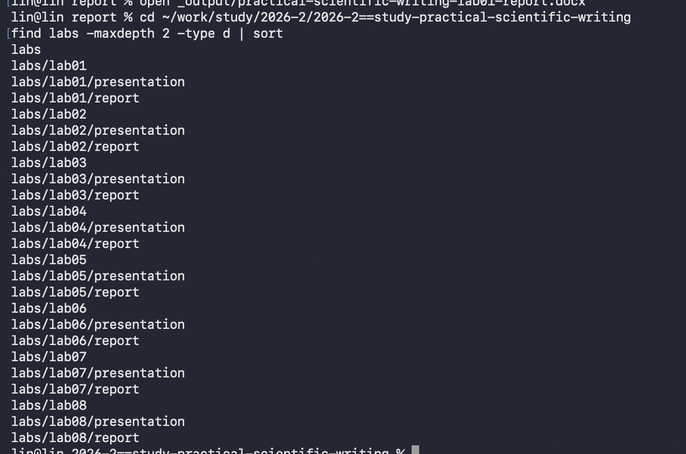
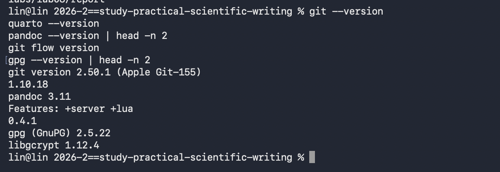
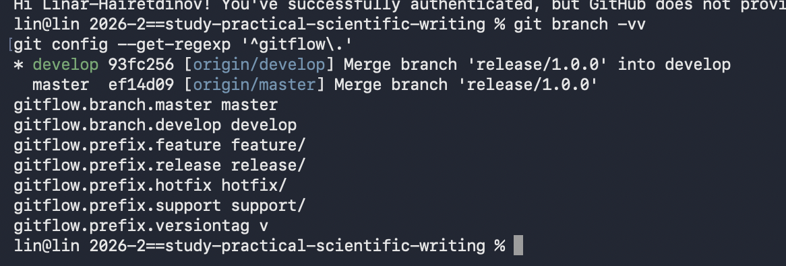
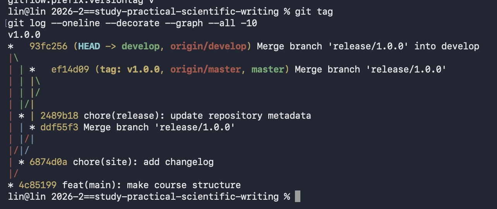

---
author:
  name: Хайретдинов Линар Ринатович
  email: 1132251129@pfur.ru
  affiliation:
    - name: Российский университет дружбы народов имени Патриса Лумумбы
      country: Российская Федерация
      city: Москва

title: "Лабораторная работа №1"
subtitle: "Подготовка рабочего пространства"
---

# Вводная часть

## Актуальность

- Для выполнения лабораторных работ необходимо единообразное рабочее пространство.
- Git позволяет сохранять историю изменений проекта.
- Git Flow используется для организации работы с ветками и релизами.
- Quarto применяется для подготовки отчётов и презентаций.

## Цель и задачи

Цель работы --- подготовить рабочее пространство для выполнения лабораторных работ курса.

Задачи:

- создать структуру каталогов курса;
- установить необходимое программное обеспечение;
- настроить Git и SSH-доступ;
- настроить Git Flow;
- подготовить первый релиз проекта.

# Выполнение работы

## Структура рабочего пространства

Рабочее пространство курса создано в каталоге `~/work/study/2026-2/2026-2==study-practical-scientific-writing`.

В результате сформированы каталоги лабораторных работ от `lab01` до `lab08`.

{width=80%}

## Установленное программное обеспечение

Для выполнения работы использованы:

- Git;
- Quarto;
- Pandoc;
- git-flow;
- GnuPG;
- GNU sed.

{width=78%}

## Настройка Git

В глобальной конфигурации Git были настроены:

- имя пользователя и электронная почта;
- отображение путей в UTF-8;
- обработка переводов строк;
- основная ветка `master`.

{width=75%}

## Настройка SSH-доступа

Для работы с удалённым репозиторием был создан SSH-ключ типа Ed25519.

После добавления открытого ключа в GitHub подключение было успешно проверено.

{width=75%}

## Настройка Git Flow

Для организации процесса разработки настроены:

- `master` --- основная стабильная ветка;
- `develop` --- ветка разработки;
- `feature/` --- функциональные ветки;
- `release/` --- ветки подготовки релизов;
- `hotfix/` --- ветки исправлений.

Для тегов версий установлен префикс `v`.

{width=75%}

## Первый релиз

После настройки рабочего пространства был подготовлен первый релиз проекта `v1.0.0`.

Ветки `master` и `develop`, а также тег `v1.0.0` были отправлены в удалённый репозиторий.

{width=75%}

# Результаты

## Результаты работы

В результате лабораторной работы:

- создана структура курса;
- настроена система контроля версий Git;
- настроен SSH-доступ к GitHub;
- настроен Git Flow;
- настроена GPG-подпись коммитов;
- подготовлен первый релиз `v1.0.0`;
- подготовлено рабочее пространство для последующих лабораторных работ.

# Заключение

## Вывод

В ходе лабораторной работы было подготовлено рабочее пространство курса.

Настроенные Git, Git Flow, SSH, GPG и Quarto позволяют вести версионирование проекта, формировать релизы и создавать отчётные материалы в воспроизводимом виде.
