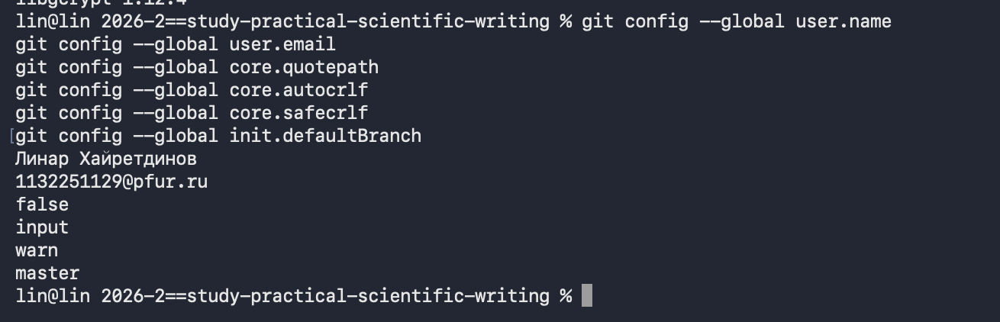

---
author:
  name: Хайретдинов Линар Ринатович
  email: 1132251129@pfur.ru
  affiliation:
    - name: Российский университет дружбы народов имени Патриса Лумумбы
      country: Российская Федерация
      postal-code: 117198
      city: Москва
      address: ул. Миклухо-Маклая, д. 6

title: "Отчёт по лабораторной работе №1"
subtitle: "Подготовка рабочего пространства"
license: "CC BY"

abstract: |
  В данной работе выполнена подготовка рабочего пространства для курса
  «Computer Skills for Scientific Writing». Создана структура курса,
  установлены необходимые программные средства, настроена система
  контроля версий Git, организован рабочий процесс Git Flow и создан
  первый релиз проекта версии 1.0.0.

keywords: [Git, Git Flow, Quarto, Markdown, рабочее пространство]
---

# Введение

## Актуальность

При подготовке научных и учебных материалов необходимо организовать рабочее пространство таким образом, чтобы исходные файлы имели единую структуру, изменения документов можно было отслеживать, а результаты работы воспроизводить.

Использование системы контроля версий Git позволяет хранить историю изменений проекта и работать с отдельными этапами его разработки. Применение Quarto позволяет создавать отчёты и презентации из исходных текстовых файлов.

## Цель работы

Цель работы --- подготовить рабочее пространство для выполнения лабораторных работ по дисциплине «Computer Skills for Scientific Writing» и настроить необходимые инструменты для дальнейшей работы.

## Задачи

Для достижения поставленной цели необходимо:

- создать рабочий каталог курса;
- получить актуальный шаблон курса;
- сформировать структуру лабораторных работ;
- установить необходимые программные средства;
- настроить Git;
- создать удалённый репозиторий;
- настроить Git Flow;
- создать первый релиз проекта.

## Объект и предмет исследования

Объект исследования --- процесс организации рабочего пространства для подготовки учебных и научных материалов.

Предмет исследования --- использование Git, Git Flow, Quarto и структурированного рабочего каталога для ведения учебного проекта.

## Методы исследования

В работе использовались методы практического конфигурирования программного окружения, выполнения команд в терминале и анализа полученных результатов.

# Теоретическая часть

Git представляет собой распределённую систему контроля версий, позволяющую сохранять историю изменений файлов проекта, создавать ветки разработки и фиксировать отдельные состояния проекта [@git_docs].

Git Flow представляет собой модель организации веток Git. В рамках данной модели используются основные ветки `master` и `develop`, а также вспомогательные ветки `feature`, `release` и `hotfix` [@gitflow_model].

Quarto представляет собой систему подготовки научной и технической документации на основе текстовой разметки. Исходные документы курса хранятся в формате `.qmd` [@quarto_docs].

Для фиксации версий проекта используется семантическое версионирование. Первый подготовленный релиз проекта имеет номер `1.0.0` [@semver].

# Материалы и методы

Работа выполнялась на персональном компьютере под управлением macOS.

В процессе выполнения работы использовались следующие программные средства:

- Git 2.50.1;
- Quarto 1.10.18;
- Pandoc 3.11;
- git-flow 0.4.1;
- GnuPG 2.5.22;
- GNU sed 4.10;
- GitHub.

Основные действия выполнялись из командной строки терминала.

# Выполнение лабораторной работы

## Создание рабочего пространства

Для хранения материалов курса был создан каталог учебного полугодия.

Использовался рабочий каталог:

`~/work/study/2026-2/2026-2==study-practical-scientific-writing`

В качестве основы был получен актуальный шаблон курса из репозитория:

`https://gitverse.ru/dharma/course-directory-student-template.git`

После перехода в каталог проекта был проверен список поддерживаемых курсов. В списке присутствовал курс `practical-scientific-writing`.

## Формирование структуры курса

В файле `COURSE` было указано название курса:

`practical-scientific-writing`

После выполнения команды `make prepare` были созданы каталоги лабораторных работ от `lab01` до `lab08`.

Каждая лабораторная работа содержит отдельные каталоги для отчёта и презентации.

На рис. -@fig-course-structure представлена сформированная структура лабораторных работ курса.

{#fig-course-structure width=85%}

## Установка программного обеспечения

Для выполнения работы были установлены Quarto, Pandoc, git-flow, GnuPG и GNU sed.

После установки были проверены версии программных средств.

На рис. -@fig-software-versions представлены версии программных средств, использованных при выполнении лабораторной работы.

{#fig-software-versions width=85%}

## Настройка Git

В глобальной конфигурации Git были указаны имя пользователя и адрес электронной почты.

Также были настроены параметры:

- `core.quotepath = false`;
- `core.autocrlf = input`;
- `core.safecrlf = warn`;
- основная ветка по умолчанию --- `master`.

На рис. -@fig-git-config представлены основные параметры глобальной конфигурации Git.

{#fig-git-config width=85%}

## Настройка SSH-доступа

Для работы с удалённым репозиторием был создан SSH-ключ типа Ed25519.

Ключ был добавлен в `ssh-agent`.

Подключение к GitHub было проверено успешно.

На рис. -@fig-github-ssh показана успешная SSH-аутентификация в GitHub.

{#fig-github-ssh width=85%}

## Создание Git-репозитория

На GitHub был создан репозиторий:

`2026-2-study-practical-scientific-writing`

Был выполнен первый коммит:

`feat(main): make course structure`

Ветка `master` была отправлена в удалённый репозиторий.

## Настройка Git Flow

Для организации процесса работы был инициализирован Git Flow.

В качестве основной ветки использовалась ветка `master`.

В качестве ветки разработки использовалась ветка `develop`.

Для вспомогательных веток использовались префиксы:

- `feature/`;
- `release/`;
- `hotfix/`;
- `support/`.

Для тегов версий был установлен префикс `v`.

После настройки ветка `develop` была отправлена в удалённый репозиторий.

На рис. -@fig-gitflow представлены основные ветки репозитория и параметры конфигурации Git Flow.

{#fig-gitflow width=85%}

## Создание первого релиза

Для подготовки первого релиза была создана ветка `release/1.0.0`.

Затем был сформирован файл `CHANGELOG.md`.

После завершения подготовки релиз был объединён с ветками `master` и `develop`.

В результате был создан тег:

`v1.0.0`

Ветки `master` и `develop`, а также тег `v1.0.0` были отправлены в GitHub.

На рис. -@fig-release представлена история ветвления репозитория и созданный тег релиза `v1.0.0`.

{#fig-release width=85%}

# Результаты

В результате выполнения лабораторной работы было создано рабочее пространство курса и сформирована структура восьми лабораторных работ.

Были установлены и настроены необходимые программные средства.

Создан Git-репозиторий проекта.

Настроены ветки `master` и `develop`.

Организован рабочий процесс Git Flow.

Сформирован первый релиз проекта версии `1.0.0` с тегом `v1.0.0`.

# Обсуждение результатов

Созданная структура позволяет выполнять последующие лабораторные работы в едином формате.

Использование Git позволяет контролировать изменения файлов проекта и хранить историю работы.

Git Flow позволяет разделить стабильную версию проекта и текущую разработку.

Использование Quarto позволяет хранить исходные материалы отчётов и презентаций в текстовом формате и автоматически формировать итоговые документы.

# Заключение

В ходе лабораторной работы было подготовлено рабочее пространство для курса «Computer Skills for Scientific Writing».

Были установлены необходимые программные средства, сформирована структура лабораторных работ и настроена система контроля версий Git.

Для организации работы с ветками был настроен Git Flow и создан первый релиз проекта версии `1.0.0`.

Поставленная цель работы достигнута.

# Список литературы {.unnumbered}

::: {#refs}

:::
