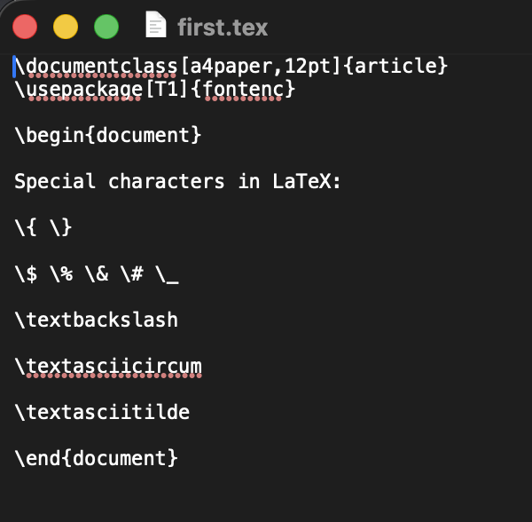
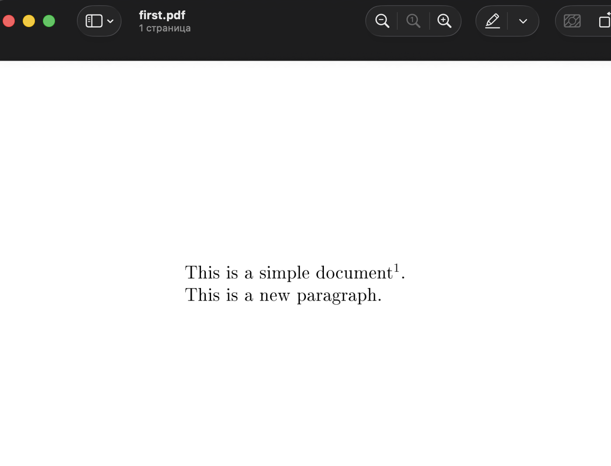

---
## Author
author:
  name: Хайретдинов Линар Ринатович
  email: 1132251129@pfur.ru
  affiliation:
    - name: Российский университет дружбы народов
      country: Российская Федерация
      postal-code: 117198
      city: Москва
      address: ул. Миклухо-Маклая, д. 6

## Title
title: "Лабораторная работа №2"
subtitle: "Структура документа LaTeX"
license: "CC BY"
date: today
date-format: "YYYY-MM-DD"
---

# Вводная часть

## Актуальность

- LaTeX широко применяется при подготовке научных и технических документов.
- Исходный документ хранится в текстовом формате `.tex`.
- Разметка отделяет содержание от оформления.
- Результат компиляции можно получить в формате PDF.

::: notes
В данной работе рассматривается базовая структура LaTeX-документа и процесс его компиляции.
:::

## Цель и задачи

**Цель:** изучить базовую структуру документа LaTeX и освоить его компиляцию в PDF.

**Задачи:**

- создать файл `first.tex`;
- изучить преамбулу и окружение `document`;
- выполнить компиляцию с помощью `pdflatex`;
- проверить комментарии и сноски;
- изучить вывод специальных символов.

# Выполнение работы

## Базовая структура документа

Минимальный документ LaTeX содержит:

```latex
\documentclass{article}
\usepackage[T1]{fontenc}

\begin{document}

Text of document.

\end{document}
```

- `\documentclass` задаёт класс документа.
- До `\begin{document}` располагается преамбула.
- Основной текст находится внутри окружения `document`.

## Исходный файл first.tex

{width=78%}

::: notes
На слайде показан исходный файл first.tex, использованный в практической части.
:::

## Компиляция документа

Для сборки использовалась команда:

```bash
pdflatex first.tex
```

После настройки `PATH` команда `pdflatex` стала доступна непосредственно из терминала.

{width=88%}

::: notes
Компиляция завершилась успешно, был создан файл first.pdf и журнал first.log.
:::

## Комментарии и сноски

Комментарии в LaTeX начинаются с символа `%` и не отображаются в PDF.

Сноска создаётся командой:

```latex
This is a simple document\footnote{with a footnote}.
```

{width=67%}

::: notes
В итоговом документе сноска автоматически размещена в нижней части страницы.
:::

## Специальные символы

Некоторые символы имеют служебное значение и требуют экранирования:

- `\{` и `\}` — фигурные скобки;
- `\$` — знак доллара;
- `\%` — процент;
- `\&` — амперсанд;
- `\#` — решётка;
- `\_` — подчёркивание;
- `\textbackslash` — обратная косая черта.

## Результат вывода специальных символов

{width=67%}

::: notes
Все проверенные специальные символы корректно отображаются после компиляции.
:::

# Результаты

## Полученные результаты

В ходе лабораторной работы:

- создан и скомпилирован файл `first.tex`;
- настроен запуск `pdflatex` из терминала;
- получен корректный `first.pdf`;
- изучены преамбула и окружение `document`;
- проверены комментарии и сноски;
- изучены способы вывода специальных символов.

## Заключение

- Базовая структура LaTeX-документа изучена.
- Компиляция через `pdflatex` выполнена успешно.
- Работа комментариев, сносок и специальных символов проверена на практике.
- Цель лабораторной работы достигнута.
