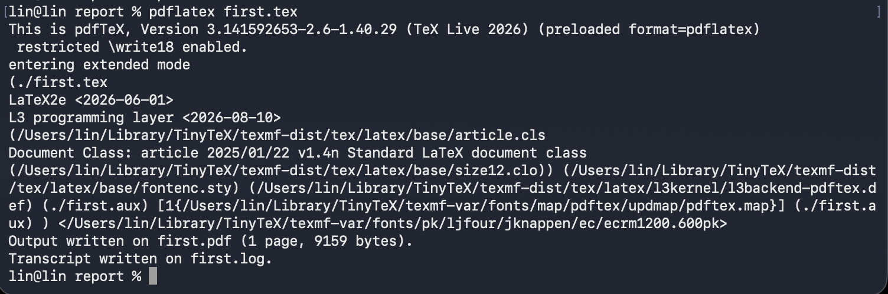
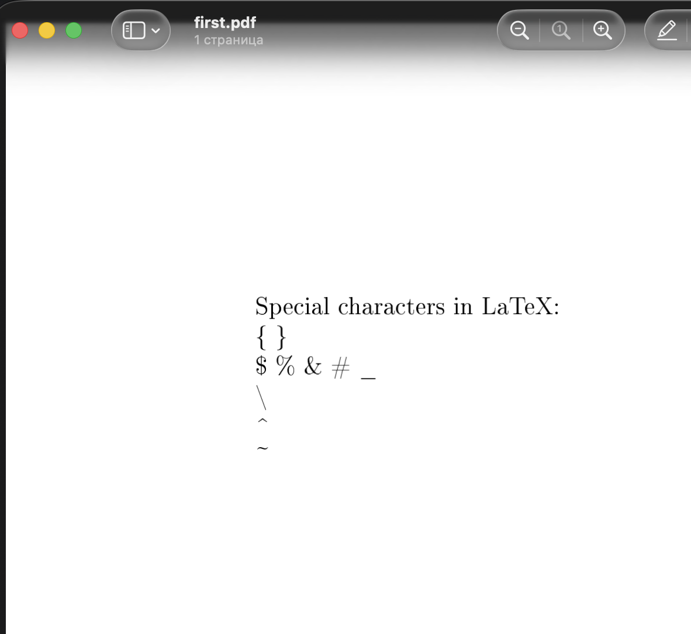

---
## Author
author:
  name: Хайретдинов Линар Ринатович
  email: 1132251129@pfur.ru
  affiliation:
    - name: Российский университет дружбы народов
      country: Российская Федерация
      postal-code: 117198
      city: Москва
      address: ул. Миклухо-Маклая, д. 6

## Title
title: "Отчёт по лабораторной работе №2"
subtitle: "Структура документа LaTeX"
license: "CC BY"
abstract: |
  В данной лабораторной работе изучена базовая структура документа LaTeX
  и процесс его компиляции в формат PDF. В ходе работы был создан исходный
  файл first.tex, рассмотрены основные элементы структуры LaTeX-документа,
  использование комментариев, сносок и специальных символов. Выполнена
  компиляция исходного файла с помощью pdflatex и проверен полученный
  PDF-документ.
keywords: [LaTeX, TeX, pdflatex, TinyTeX, научное письмо, лабораторная работа]
bibliography: bib/cite.bib
---

# Введение

## Актуальность

LaTeX является системой подготовки документов, широко применяемой при
создании научных и технических текстов. В отличие от традиционных
текстовых процессоров, в LaTeX пользователь работает с исходным текстовым
файлом, содержащим текст документа и специальные команды разметки.
После обработки исходного файла системой TeX формируется готовый документ,
например в формате PDF [@latex_project].

Такой подход позволяет отделить содержание документа от его оформления,
обеспечить единообразное форматирование и упростить дальнейшую работу
с математическими формулами, таблицами, рисунками, перекрёстными ссылками
и библиографией.

## Цель работы

Цель лабораторной работы --- изучить базовую структуру документа LaTeX
и освоить процесс компиляции исходного файла в формат PDF.

## Задачи

Для достижения поставленной цели необходимо было выполнить следующие задачи:

- создать простой исходный файл LaTeX;
- изучить назначение команды `\documentclass`;
- рассмотреть структуру преамбулы и тела документа;
- выполнить компиляцию документа с помощью `pdflatex`;
- изучить использование комментариев в LaTeX;
- добавить сноску в документ;
- изучить способы вывода специальных символов;
- проверить полученный PDF-документ.

## Объект и предмет исследования

Объектом исследования является система компьютерной вёрстки LaTeX.

Предметом исследования являются структура исходного файла LaTeX,
основные команды разметки и процесс компиляции исходного файла
в итоговый документ формата PDF.

## Методы исследования

В работе использовались методы практического эксперимента,
последовательного изменения исходного файла и анализа результатов
его компиляции.

# Теоретическая часть

LaTeX представляет собой систему подготовки документов, основанную
на использовании текстового исходного кода и специальных команд разметки.
Исходные файлы LaTeX обычно имеют расширение `.tex` [@learnlatex_structure].

Минимальный документ LaTeX содержит объявление класса документа,
при необходимости преамбулу с подключаемыми пакетами и основное окружение
`document`.

Базовая структура документа имеет следующий вид:

```latex
\documentclass{article}
\usepackage[T1]{fontenc}

\begin{document}

Text of document.

\end{document}
```

Команда

```latex
\documentclass{article}
```

задаёт класс документа. В данном случае используется класс `article`.

Часть исходного файла, расположенная перед командой
`\begin{document}`, называется преамбулой. В преамбуле задаются
параметры документа и подключаются дополнительные пакеты.

Например, команда

```latex
\usepackage[T1]{fontenc}
```

подключает пакет для настройки кодировки шрифтов.

Основное содержимое документа располагается между командами

```latex
\begin{document}
```

и

```latex
\end{document}
```

Пары команд `\begin{...}` и `\end{...}` образуют окружения.
Каждому открывающему окружению должно соответствовать закрывающее.

Для преобразования исходного файла в PDF может использоваться программа
`pdflatex`:

```bash
pdflatex first.tex
```

В процессе компиляции формируется итоговый PDF-файл и ряд вспомогательных
файлов. В частности, файл с расширением `.log` содержит журнал работы
компилятора и может использоваться для диагностики ошибок.

Комментарии в исходном файле LaTeX начинаются с символа `%`.
Содержимое после данного символа не выводится в итоговом документе.

Например:

```latex
% Это комментарий
This text will be displayed.
```

Для создания сносок используется команда `\footnote`.

Например:

```latex
This is a simple document\footnote{with a footnote}.
```

Некоторые символы имеют специальное значение в синтаксисе LaTeX.
Для их непосредственного отображения необходимо использовать
экранирование или специальные команды.

| Символ | Команда для вывода |
|---|---|
| `{` | `\{` |
| `}` | `\}` |
| `$` | `\$` |
| `%` | `\%` |
| `&` | `\&` |
| `#` | `\#` |
| `_` | `\_` |
| `\` | `\textbackslash` |
| `^` | `\textasciicircum` |
| `~` | `\textasciitilde` |

: Способы вывода специальных символов LaTeX {#tbl-special-symbols}

# Материалы и методы

Лабораторная работа выполнялась на персональном компьютере под управлением
macOS.

В ходе работы использовались:

- терминал с командной оболочкой `zsh`;
- система контроля версий Git;
- дистрибутив TinyTeX;
- система LaTeX;
- программа `pdflatex`;
- текстовый формат `.tex`;
- формат итогового документа PDF;
- Quarto для подготовки отчёта.

TinyTeX представляет собой облегчённый дистрибутив TeX Live,
предназначенный в том числе для воспроизводимой подготовки документов
[@tinytex].

Практическая часть выполнялась в каталоге:

```text
labs/lab02/report
```

Основным исходным файлом практической части являлся:

```text
first.tex
```

# Выполнение лабораторной работы

## Создание первого документа LaTeX

В каталоге отчёта лабораторной работы был создан файл `first.tex`
со следующим содержимым:

```latex
\documentclass{article}
\usepackage[T1]{fontenc}

\begin{document}

Hey world!

This is a first document.

\end{document}
```

В первой строке был указан класс документа `article`.
В преамбуле был подключён пакет `fontenc`.
Основной текст документа был расположен внутри окружения `document`.

На рис. -@fig-first-tex представлен исходный файл `first.tex`.

{#fig-first-tex width=75%}

## Настройка доступа к pdflatex

При первой попытке выполнить компиляцию командой

```bash
pdflatex first.tex
```

командная оболочка сообщила:

```text
zsh: command not found: pdflatex
```

Проверка показала, что TinyTeX установлен в системе, однако каталог
с его исполняемыми файлами отсутствовал в переменной окружения `PATH`.

Исполняемый файл `pdflatex` был найден по пути:

```text
/Users/lin/Library/TinyTeX/bin/universal-darwin/pdflatex
```

Исполняемый файл `lualatex` находился в том же каталоге:

```text
/Users/lin/Library/TinyTeX/bin/universal-darwin/lualatex
```

Для добавления каталога TinyTeX в переменную окружения `PATH`
в файл `~/.zshrc` была добавлена строка:

```bash
export PATH="$HOME/Library/TinyTeX/bin/universal-darwin:$PATH"
```

После этого конфигурация командной оболочки была перечитана:

```bash
source ~/.zshrc
```

После выполнения данной настройки команда `pdflatex` стала доступна
из терминала.

## Компиляция первого документа

Для компиляции исходного файла была выполнена команда:

```bash
pdflatex first.tex
```

Компиляция завершилась успешно.

В терминале было получено сообщение:

```text
Output written on first.pdf (1 page, 6877 bytes).
Transcript written on first.log.
```

После компиляции в каталоге находились следующие файлы:

```text
first.aux
first.log
first.pdf
first.tex
```

Файл `first.tex` содержал исходный код документа.

Файл `first.pdf` являлся результатом компиляции.

Файл `first.log` содержал журнал работы компилятора.

Файл `first.aux` содержал вспомогательную информацию, используемую
системой LaTeX.

На рис. -@fig-pdflatex-success показан результат успешной компиляции
исходного файла с помощью `pdflatex`.

{#fig-pdflatex-success width=90%}

Полученный документ был открыт командой:

```bash
open first.pdf
```

В PDF корректно отобразились строки:

```text
Hey world!

This is a first document.
```

Также системой LaTeX был автоматически добавлен номер страницы.

## Использование параметров класса документа

На следующем этапе исходный файл был изменён.

Для класса `article` были добавлены параметры:

```latex
\documentclass[a4paper,12pt]{article}
```

Параметр `a4paper` задаёт размер страницы A4, а параметр `12pt`
задаёт базовый размер шрифта документа.

## Использование комментариев

В исходный документ были добавлены комментарии:

```latex
%% The document class with options
\documentclass[a4paper,12pt]{article}

%% Select T1 font encoding
\usepackage[T1]{fontenc}

%% A comment in the preamble
```

Также комментарий был добавлен непосредственно перед текстом документа:

```latex
%% This is a comment
```

После компиляции было установлено, что комментарии присутствуют
только в исходном файле и не отображаются в итоговом PDF.

## Использование сносок

Для проверки механизма сносок в исходный документ была добавлена команда
`\footnote`:

```latex
This is a simple document\footnote{with a footnote}.
```

Полный фрагмент выглядел следующим образом:

```latex
\begin{document}

%% This is a comment
This is a simple document\footnote{with a footnote}.

This is a new paragraph.

\end{document}
```

После выполнения повторной компиляции:

```bash
pdflatex first.tex
```

в итоговом документе появилась сноска в нижней части страницы.

На рис. -@fig-footnote представлен результат компиляции документа
со сноской.

{#fig-footnote width=70%}

Текст

```text
This is a new paragraph.
```

был расположен в отдельном абзаце благодаря наличию пустой строки
в исходном файле.

## Работа со специальными символами

На заключительном этапе были проверены способы вывода специальных
символов LaTeX.

Файл `first.tex` был приведён к следующему виду:

```latex
\documentclass[a4paper,12pt]{article}
\usepackage[T1]{fontenc}

\begin{document}

Special characters in LaTeX:

\{ \}

\$ \% \& \# \_

\textbackslash

\textasciicircum

\textasciitilde

\end{document}
```

После этого снова была выполнена команда:

```bash
pdflatex first.tex
```

Компиляция завершилась успешно.

Полученный файл был открыт:

```bash
open first.pdf
```

В документе корректно отобразились фигурные скобки, знак доллара,
процент, амперсанд, решётка, знак подчёркивания, обратная косая черта,
циркумфлекс и тильда.

На рис. -@fig-special-symbols показан результат вывода специальных
символов в итоговом PDF-документе.

{#fig-special-symbols width=70%}

Таким образом, была практически подтверждена необходимость специальной
записи символов, которые имеют служебное значение в синтаксисе LaTeX.

# Результаты

В результате выполнения лабораторной работы:

- создан исходный файл `first.tex`;
- проверена базовая структура документа LaTeX;
- изучено назначение команды `\documentclass`;
- рассмотрено назначение преамбулы;
- изучено окружение `document`;
- настроен запуск `pdflatex` из терминала;
- выполнена успешная компиляция `.tex`-файла;
- получен итоговый файл `first.pdf`;
- изучено назначение файлов `.aux` и `.log`;
- проверено использование комментариев;
- создана сноска с помощью команды `\footnote`;
- проверено формирование отдельных абзацев;
- изучены способы вывода специальных символов LaTeX.

Практическая часть была выполнена успешно, а полученные PDF-документы
корректно отображались средствами просмотра macOS.

# Обсуждение результатов

В ходе лабораторной работы было установлено, что исходный документ LaTeX
имеет строгую логическую структуру.

Команда `\documentclass` определяет класс документа. Преамбула содержит
параметры документа и подключаемые пакеты, а основной текст располагается
внутри окружения `document`.

Компиляция с помощью `pdflatex` преобразует текстовый исходный файл
в готовый PDF-документ. Одновременно создаются вспомогательные файлы,
которые используются системой LaTeX при обработке документа.

Возникшая в начале работы проблема отсутствия команды `pdflatex`
была связана не с отсутствием TinyTeX, а с тем, что каталог исполняемых
файлов TinyTeX не находился в переменной окружения `PATH`.
После добавления соответствующего каталога компиляция стала доступна
непосредственно из терминала.

Практическая проверка комментариев показала, что они могут использоваться
для пояснения исходного кода без изменения итогового документа.

Использование команды `\footnote` позволило автоматически создать
и оформить сноску.

Также было установлено, что часть символов в LaTeX имеет специальное
синтаксическое значение. Для их непосредственного вывода необходимо
использовать экранирование или специальные команды.

Полученные навыки являются основой для дальнейшей работы с более сложными
элементами LaTeX: математическими формулами, рисунками, таблицами,
перекрёстными ссылками, библиографией и презентациями.

# Заключение

В ходе лабораторной работы была изучена базовая структура документа LaTeX.

Был создан исходный файл `first.tex` и выполнена его успешная компиляция
в формат PDF с помощью программы `pdflatex`.

Были рассмотрены:

- класс документа;
- преамбула;
- окружение `document`;
- комментарии;
- параметры класса документа;
- сноски;
- специальные символы;
- вспомогательные файлы, создаваемые при компиляции.

Также была выполнена настройка переменной окружения `PATH`,
после чего инструменты TinyTeX стали доступны непосредственно
из командной строки.

Поставленная цель лабораторной работы достигнута.
Полученные навыки могут быть использованы при дальнейшем изучении
средств автоматизированной подготовки научных документов.

# Список литературы {.unnumbered}

::: {#refs}
:::
